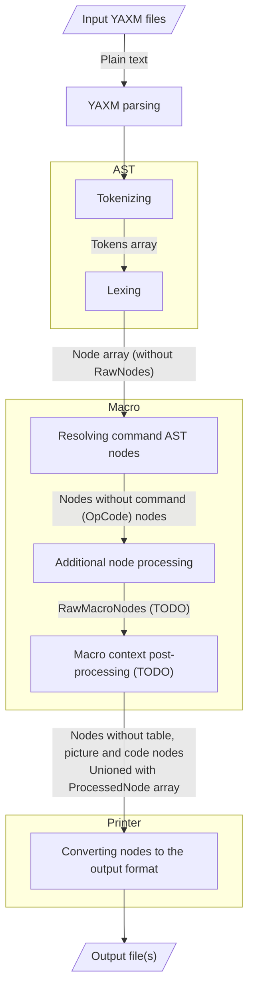

```mermaid
graph TD
    A[/"Input YAXM files"/]
    B["YAXM parsing"]
    A-->|Plain text|B
    B --> C
    subgraph _1["AST"]
        C["Tokenizing"]
        D["Lexing"]
        C -->|Tokens array| D
    end
    D -->|"Node array (without RawNodes)"| E
    subgraph _2["Macro"]
        E["Resolving command AST nodes"]
        F["Additional node processing"]
        E -->|"Nodes without command (OpCode) nodes"| F
        F -->|"RawMacroNodes (TODO)"| F1
        F1["Macro context post-processing (TODO)"]
    end

    F1 -->|"Nodes without table, picture and code nodes<br>Unioned with ProcessedNode array"| G
    subgraph _3["Printer"]
        G["Converting nodes to the output format"]
    end

    G --> Z
    Z[/"Output file(s)"/]
```
